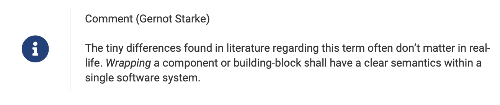

# iSAQB® Glossary of Software Architecture Terminology

>NOTE: As of November 2022, we migrate the content of this book from Markdown to AsciiDoc, to enable a more flexible output generation pipeline.
> 
>During this (rather lengthy) migration, only the Leanpub version of the glossary is available - which has been published 2020 (if I remember correctly).
>
>Please be patient - the new version should be available January 2023 latest.

A comprehensive glossary of software architecture terminology, many of them used in the iSAQB® foundation and advanced level curricula.


This repository contains the sources for the published version of the iSAQB® glossary, in various formats:

* [Leanpub (https://leanpub.com/isaqbglossary)](https://leanpub.com/isaqbglossary), which was the original format
* (planned) pdf from the iSAQB® download page at Github
* (planned) online-html

We also keep our reference translations, currently between English <-> German, these are [generated](#generating-the-translation-tables) from a JSON document into the markdown book source. 

This book is made possible by **collaborative effort** of several [iSAQB® e.V.](http://isaqb.org) members.
It's intended to **support the non-profit interests** of the iSAQB® and the software architecture community in general.

## Natural Languages: English and German

The original authors of this glossary promised to care for English first, German second.
We (currently) don't support additional languages, but are *very open* for suggestions.

Our build and generation infrastructure can theoretically support an arbitrary number of other languages.


## Suggestions Welcome
We welcome suggestions and critique of any kind: Just [open an issue](https://github.com/isaqb-org/glossary/issues) here on Github!

## Checkout and Build
Make sure to clone the repository including its submodules:

```bash
Via SSH:
git clone git@github.com:isaqb-org/glossary.git --recursive

Via HTTPS:
git clone https://github.com/isaqb-org/glossary.git --recursive
```
You can then build the glossary via `./gradlew buildDocs` to build both the English and German version.


## Source Code Organization

* Every term has a definition in a separate (adoc-)file under `/docs/1-terms`. You find subdirectories for every letter, so we don't have too many files in single directories.
* Every term needs to explicitly included in the glossary by adding it to the file `0-structure.adoc` in its letter subdirectory.
* Consider both EN and DE version
## Book Generation (aka "build")

Between 2014 and Oct 2022, preview and production builds had to be triggered via the Leanpub website.

From November 2022, we build the glossary and all output formats with Gradle, based upon AsciiDoc.

## About Translation tables

The tables are generated by a small Groovy script from a JSON file. 
Its format is a simple list  with map entries, in file `translations/isaqb-terms-translated.json`.
 

```
[
  { en: "Appropriateness",
    de: "Angemessenheit"
  },
  { en: "Architectural View",
    de: ["Architektursicht", "Sicht"]
  }
  // many more words...
]  
```

If a single (English) term has multiple translations, as in line 6 (`de: ["Architektursicht", "Sicht"]`), use a JSON list.

This file is parsed, lightly validated for syntax errors and then converted  to AsciiDoc, one table per language, currently German ("de") and English ("en").

### Generating the Translation Tables
You can build the translation tables by calling `./gradlew generateTranslationTables` (on unix or osx) or `.\gradlew.bat generateTranslationTables` from the command line.

(of course you could use your own installed Gradle, if you prefer so)

The translator generates one adoc file for every language. 
Currently  you need to manually copy those into the `docs/2-translations/` directory.

The translation tables currently **only support two languages**, EN and DE.

### Rules for Translation

1. English is the _master_ language, code "en".
2. Every entry needs to have an English term.
3. Every entry must have at least a single translation to another language,e.g. from en to de.
4. A term might have a list of translations in other languages (e.g. en:Tradeoff translates  to de:[Kompromiss, Abwägung]


## About Term translations

Each term can be described in multiple languages, denoted by the `{lang=[language-code]}` in their respective files (`manuscript/terms`).


## About personal opinion

As this book combines the efforts of several authors, some _personal opinions_ or  comments might be added, to give a broader perspective on some definitions.

If you want to add your opinion or comment to any term in the glossary, please  use the AsciiDoc "admonition" feature like shown below:

```
[NOTE] 
====
Comment (Gernot Starke)

The tiny differences found in literature regarding this term often don’t matter in real- life. 
Wrapping a component or building-block shall have a clear semantics within a single software system.
====
```

This will yield the following output (captured from the pdf version, will look different in web or epub versions):




## Contributors

The initial version of this glossary has been contributed by [Gernot Starke](http://gernotstarke.de).
Prior versions of the (German) iSAQB® glossary had been compiled and  edited by Dr. Ulrich Becker, Wolfgang Fahl, Phillip Ghadir, Dr. Peter Hruschka, Dr. Carola Lilienthal, Martin Roesch and others.


Currently the content is maintained by volunteers from the [iSAQB® e.V.](http://isaqb.org), a non-profit volunteer association - see the contributors list of this repository.

#### How to Become Contributor

You can become contributor (and will be added to the Leanpub contributor page) if you:

1. Fix 3 or more issues from the GitHub issue list
2. Open 5 significant issues (typos, spelling mistakes, simple formating issues and
  other trivial stuff does not qualify as _significant_).
3. Provide significant input by mail or other means to existing authors.

Statements of the form "xy should be done, but I won't do it.." without further contributions do not qualify as _significant_.  


## Donating to EFF (Electronic Frontier Foundation)

All royalties from Leanpub sales of this book are donated to the [Electronic Frontier Foundation (eff.org)](http://eff.org).


## License

This book is licensed under a [Creative Commons Attribution 4.0 International License](https://creativecommons.org/licenses/by/4.0/).


The following is only a brief summary and no substitution for the real  [licence](https://creativecommons.org/licenses/by/4.0/).


The cc-4.0-by license means that you might:

* Share — copy and redistribute the material in any medium or format
* Adapt — remix, transform, and build upon the material for any purpose, even commercially.
* The licensor cannot revoke these freedoms as long as you follow the license terms.

You must:

* Give **appropriate credit**,
* Provide a link to the license (https://creativecommons.org/licenses/by/4.0/), and
* Indicate if changes were made.
