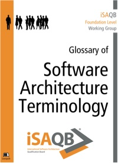

# iSAQB Glossary of Software Architecture Terminology

A comprehensive glossary of software architecture terminology,
many of them used in the iSAQB foundation and advanced level curricula.

This repository contains the sources for the published version of
the iSAQB glossary, available both online and in various eBook formats
at [Leanpub (https://leanpub.com/isaqbglossary)](https://leanpub.com/isaqbglossary).

## Suggestions Welcome

We welcome suggestions and critique of any kind: Just 
[open an issue](https://github.com/isaqb-org/glossary/issues) 
here on Github!

## Contributors

The initial version of this glossary has been contributed by [Gernot Starke](http://gernotstarke.de).
Prior versions of an (German) glossary had been compiled and edited by Dr. Ulrich Becker,
Phillip Ghadir and others.

Currently the contens are maintained by volunteers from the [iSAQB e.V.](http://isaqb.org),
a non-profit volunteer association - most of them are mentioned the contributors list of this repository.

## Legal

This book is licensed under a
[Creative Commons Attribution 4.0 International License](https://creativecommons.org/licenses/by/4.0/).

The following is only a brief summary and no substitution for the real 
[licence](https://creativecommons.org/licenses/by/4.0/).

The cc-4.0-by license means that you might:

* Share — copy and redistribute the material in any medium or format
* Adapt — remix, transform, and build upon the material for any purpose, even commercially.
* The licensor cannot revoke these freedoms as long as you follow the license terms.

You must: 

* Give **appropriate credit**, 
* Provide a link to the license (https://creativecommons.org/licenses/by/4.0/), and
* Indicate if changes were made. 

