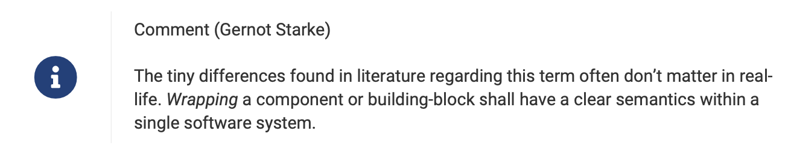

# iSAQB® Glossary of Software Architecture Terminology

A comprehensive glossary of software architecture terminology, many of them used in the iSAQB® foundation and advanced level curricula.

== Status
image:https://github.com/isaqb-org/glossary/actions/workflows/build_main.yml/badge.svg?branch=main["CI – Releases and Main"]
image:https://img.shields.io/github/last-commit/isaqb-org/glossary/main.svg["Last commit"]
image:https://img.shields.io/github/contributors/isaqb-org/glossary.svg["Contributors",link="https://github.com/isaqb-org/glossary/graphs/contributors"]
image:https://img.shields.io/github/issues/isaqb-org/glossary.svg["Issues",link="https://github.com/isaqb-org/glossary/issues"]
image:https://img.shields.io/github/issues-closed/isaqb-org/glossary.svg["Issues closed",link="https://github.com/isaqb-org/glossary/issues?utf8=%E2%9C%93&q=is%3Aissue+is%3Aclosed+"]

This repository contains the sources for the published version of the iSAQB® glossary, in various formats:

* [Leanpub (https://leanpub.com/isaqbglossary)](https://leanpub.com/isaqbglossary), which was the original format
* PDF document in [German](https://public.isaqb.org/glossary/glossary-de.pdf) and [English](https://public.isaqb.org/glossary/glossary-en.pdf) with nice cover
* HTML document in [German](https://public.isaqb.org/glossary/glossary-de.html) and [English](https://public.isaqb.org/glossary/glossary-en.html)

We also keep our reference translations, currently between English <-> German, these are generated from a JSON document into the asciidoc book source. 

This book is made possible by **collaborative effort** of several [iSAQB® e.V.](http://isaqb.org) members.
It's intended to **support the non-profit interests** of the iSAQB® and the software architecture community in general.

## Natural Languages: English and German

The original authors of this glossary promised to care for English first, German second.
We (currently) don't support additional languages, but are *very open* for suggestions.

Our build and generation infrastructure can theoretically support an arbitrary number of other languages.


## Suggestions Welcome
We welcome suggestions and critique of any kind: Just [open an issue](https://github.com/isaqb-org/glossary/issues) here on GitHub!

## Checkout and Build
Make sure to clone the repository including its submodule:

```bash
Via SSH:
git clone git@github.com:isaqb-org/glossary.git --recursive

Via HTTPS:
git clone https://github.com/isaqb-org/glossary.git --recursive
```
You can then build the glossary with `./curriculum-build.sh` (Linux/macOS) or `curriculum-build.bat` (Windows) to build both the English and German version (PDF and HTML) into `build/`.
The only prerequisite is Docker: the build runs in the pinned [iSAQB curriculum-builder](https://github.com/isaqb-org/curriculum-builder) image.

```bash
./curriculum-build.sh      # all languages and formats
./curriculum-build.sh pdf EN   # single format + language
```

## Source Code Organization

* Every term has a definition in a separate (adoc-)file under `/docs/1-terms`. You find subdirectories for every letter, so we don't have too many files in single directories.
* Terms are collected automatically: every `term*.adoc` file below `/docs/1-terms` is included, sorted alphabetically by its caption per language (see [Generated Sources](#generated-sources)).
* Consider both EN and DE version
* 
## Book Generation (aka "build")

We build the glossary and all output formats from AsciiDoc with the iSAQB curriculum-builder (native Ruby `asciidoctor` and `asciidoctor-pdf` in a Docker image).
Per-repository settings live in `build.config`.

### Generated Sources
Before each render, the Ruby extension `extensions/glossary-generators.rb` (loaded via `ASCIIDOCTOR_COMMON_OPTS` in `build.config`) generates:

* `docs/1-terms/0-structure-EN.adoc` and `0-structure-DE.adoc`: the alphabetically sorted term index per language, with a heading per initial letter.
* `docs/2-translations/gen-tt-EN-DE.adoc` and `gen-tt-DE-EN.adoc`: the [translation tables](#about-translation-tables).

These files are not under version control. If the translation JSON violates the [rules](#rules-for-translation), the build will fail.
To (re-)generate them without a full build, e.g. for an AsciiDoc preview in your IDE, run `ruby extensions/glossary-generators.rb` (requires a local Ruby).

The Leanpub version has to be uploaded to the publisher manually.

## About Translation tables

The tables are generated by a small Ruby script from a JSON file.
Its format is a simple list with map entries, in file `translations/isaqb-terms-translated.json`.
 

```json
[
 { "en": "Appropriateness",
  "de": "Angemessenheit"
 },
 { "en": "Architectural View",
  "de": ["Architektursicht", "Sicht"]
 }
]
```

The file must be strict JSON (quoted keys, no trailing commas).
If a single (English) term has multiple translations, as in line 6 (`"de": ["Architektursicht", "Sicht"]`), use a JSON list.

This file is parsed, lightly validated for syntax errors and then converted to AsciiDoc, one table per language, currently German ("de") and English ("en").

### Generating the Translation Tables
The tables are generated automatically with every build, see [Generated Sources](#generated-sources).

The translation tables currently **only support two languages**, EN and DE.

### Rules for Translation

1. English is the _main_ language, code "en".
2. Every entry needs to have an English term.
3. Every entry must have at least a single translation to another language,e.g. from en to de.
4. A term might have a list of translations in other languages (e.g. en:Tradeoff translates to de:[Kompromiss, Abwägung]), which must then contain at least two entries.
5. Only the keys `en` and `de` are allowed, and the English and German words must differ.


## About Term translations
Each term can be described in multiple languages, denoted by the `{lang=[language-code]}` in their respective files (`manuscript/terms`).

## About personal opinion
As this book combines the efforts of several authors, some _personal opinions_ or comments might be added, to give a broader perspective on some definitions.

If you want to add your opinion or comment to any term in the glossary, please use the AsciiDoc "admonition" feature like shown below:

```
[NOTE] 
====
Comment (Gernot Starke)

The tiny differences found in literature regarding this term often don’t matter in real- life. 
Wrapping a component or building-block shall have a clear semantics within a single software system.
====
```

This will yield the following output (captured from the pdf version, will look different in web or epub versions):



## Contributors

The initial version of this glossary has been contributed by [Gernot Starke](http://gernotstarke.de).
Prior versions of the (German) iSAQB® glossary had been compiled and edited by Dr. Ulrich Becker, Wolfgang Fahl, Phillip Ghadir, Dr. Peter Hruschka, Dr. Carola Lilienthal, Martin Roesch and others.

Currently, the content is maintained by volunteers from the [iSAQB® e.V.](http://isaqb.org), a non-profit volunteer association - see the contributors list of this repository.

#### How to Become Contributor

You can become contributor (and will be added to the Leanpub contributor page) if you:

1. Fix 3 or more issues from the GitHub issue list
2. Open 5 significant issues (typos, spelling mistakes, simple formating issues and
 other trivial stuff does not qualify as _significant_).
3. Provide significant input by mail or other means to existing authors.

Statements of the form "xy should be done, but I won't do it.." without further contributions do not qualify as _significant_. 

## Donating to EFF (Electronic Frontier Foundation)

All royalties from Leanpub sales of this book are donated to the [Electronic Frontier Foundation (eff.org)](http://eff.org).


## License

This book is licensed under a [Creative Commons Attribution 4.0 International License](https://creativecommons.org/licenses/by/4.0/).


The following is only a brief summary and no substitution for the real [license](https://creativecommons.org/licenses/by/4.0/).

The cc-4.0-by license means that you might:

* Share — copy and redistribute the material in any medium or format
* Adapt — remix, transform, and build upon the material for any purpose, even commercially.
* The licensor cannot revoke these freedoms as long as you follow the license terms.

You must:

* Give **appropriate credit**,
* Provide a link to the license (https://creativecommons.org/licenses/by/4.0/), and
* Indicate if changes were made.
